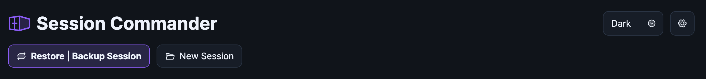
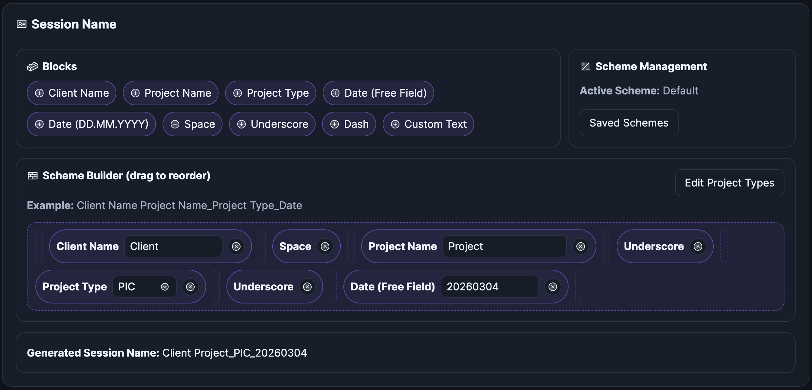

# Session Commander

---
## Overview
 
This tool is designed to help studio houses manage sessions more efficiently, but can be used by any Pro Tools engineer with a network storage system.
The idea is as follows:

- If you use separate network storage locations to run your sessions from and to store your sessions, this facilitates transfers between them
without needing your working machine to act as the middleman
- Sessions can be prepped and transferred to the relevant working location, or backed up from the working location to the storage location
from any computer on the network without needing to involve the working location machine/s directly

This means a studio assistant/producer can make sure the next session is available on the relevant studio's machine while the engineer is working.
This is especially useful if the engineer has back-to-back sessions and saves time on the restore/backup process.

The tool also has a very handy drag-and-drop naming scheme builder for session naming, which applies to the session folder as well as the `.ptx` file.
Multiple naming schemes can also be saved if necessary.

 
 
> ***This tool assumes you save your Pro Tools templates as actual session folders and not template files.***

---

- [Docker Container Setup]()

- [App Setup Process]()

- [Email Notifications]()

- [App Usage]()
