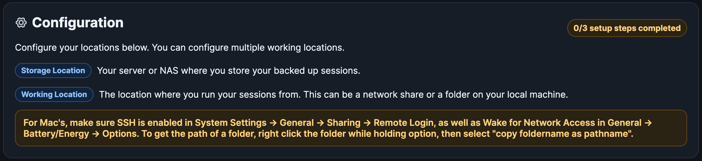
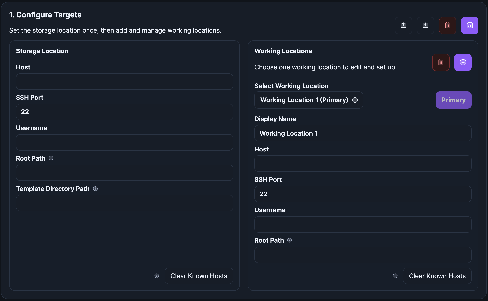
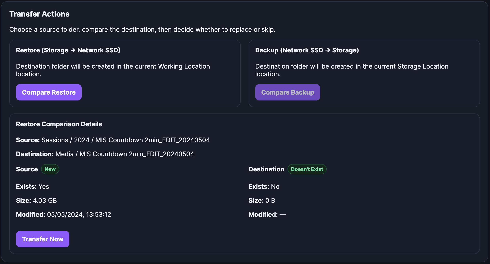

# Session Commander

---
## Overview
 
This tool is designed to help studio houses manage sessions more efficiently, but can be used by any Pro Tools engineer with a network storage system.
The idea is as follows:

- If you use separate network storage locations to run your sessions from and to store your sessions, this facilitates transfers between them
without needing your working machine to act as the middleman
- Sessions can be prepped and transferred to the relevant working location, or backed up from the working location to the storage location
from any computer on the network without needing to involve the working location machine/s directly

This means a studio assistant/producer can make sure the next session is available on the relevant studio's machine while the engineer is working.
This is especially useful if the engineer has back-to-back sessions and saves time on the restore/backup process.

The tool also has a very handy drag-and-drop naming scheme builder for session naming, which applies to the session folder as well as the `.ptx` file.
Multiple naming schemes can also be saved if necessary.

 
 
> ***This tool assumes you save your Pro Tools templates as actual session folders and not template files.***
 

---
## Setup Process

The Setup page prepares all `SSH` trust required for **Session Commander** to run direct location-to-location transfers, as well as container-to-location browsing.
 
 
---
### App Requirements
 
**Session Commander** uses three systems:

- **Storage Location**: Source of session backups and templates.
- **Working Location**: Location where sessions are run from. This can be a network share or a folder on your local machine.
- **Docker container**: the web app and orchestrator

The container does not copy files through itself.
Instead, it connects over `SSH` and tells one location to copy directly to the other location using `rsync` or `scp` as a backup. Because of that, `SSH` trust must exist in multiple directions.

**Step 1: Configure Targets**

This step stores the connection details for both locations:

- host / IP
- SSH port
- username
- root path used over `SSH`

It also accepts temporary bootstrap passwords for the locations.

These passwords are:

- Used only during setup actions
- Kept only in memory and is removed upon refresh

The saved config is written to data/config.json.
 
 
 
**Step 2: Authorize Container Access**

This is a one-click setup step that prepares the Docker container to log into both locations.

When you click **"Authorize Container"**, the app:

- Generates an `SSH` keypair inside the container (if it does not already exist)
- Installs the container public key into the selected SSH account on the Storage Location and Working Location
- Tests `SSH` connectivity to both systems
- Checks whether `rsync` and `scp` are available on each system

This enables:

container → Storage
 
container → Working

The container keypair is stored under:

`data/ssh/id_ed25519`
 
`data/ssh/id_ed25519.pub`

Container key comment (for identification/cleanup):

`session-commander-container`
 
 
 
**Step 3: Enable Direct location-to-location Trust**

The app needs the locations to trust each other so one location can push files directly to the other.

This is split into two one-click actions:

**3.1. Enable Storage → Working**

This action:

- Generates an `SSH` keypair on the Storage Location account (if needed)
- Installs the Storage Location public key into the Working Location account’s authorized_keys
- Tests direct `SSH` from Storage → Working

This is used for restoring sessions or copying templates from storage location → working location.
 
 
**3.2. Enable Working → Storage**

This action:

- Generates an `SSH` keypair on the Working Location account (if needed)
- Installs the Working Location public key into the Storage Location account’s authorized_keys
- Tests direct `SSH` from Working → Storage

This is used for backing up active sessions from working location → storage location.
 
 
Peer key location on each remote system:

`~/.ssh/ptsh_peer_ed25519`
`~/.ssh/ptsh_peer_ed25519.pub`

Peer key comment (for identification/cleanup):

`session-commander-peer`
 
 
**Why this setup is required**

**Session Commander** is designed so file transfers happen directly between the two locations, and not via your working machine. This doesn't matter if you run sessions locally on your working machine.

That means:

- The browser never handles file data
- The Docker container does not act as a file relay
- The app only coordinates `SSH` commands

This keeps transfers aligned with the intended architecture and avoids routing session data through the local machine.
 
 

---
### Transfer Method

**Session Commander** uses `scp` for direct folder copies.

Generally, `scp` is installed by default on most systems, so this avoids depending on `rsync` being installed.

`rsync` is still detected during setup for information, but it is not required for operation yet.

 

---
### Security Notes
 

- Bootstrap passwords are temporary and are not stored
- Persistent access is provided through `SSH` keys
- The container stores only its own `SSH` keypair and non-sensitive config
- Location-to-location trust is established only between the configured `SSH` accounts

 

**Clear Config + Clear SSH Keys Behavior**

The app clears keys in two groups:

container → locations:

- Removes `/app/data/ssh/id_ed25519` and `/app/data/ssh/id_ed25519.pub in the container
- Removes authorized_keys entries matching the current container public key
- Removes authorized_keys entries with `session-commander-container` marker

location → location:

- Removes `~/.ssh/ptsh_peer_ed25519` and `~/.ssh/ptsh_peer_ed25519.pub` on both configured systems
- Removes authorized_keys entries matching the current peer public keys
- Removes authorized_keys entries with `session-commander-peer` marker

 

**Important:**

For best security, use dedicated service accounts where possible instead of `root`, unless the platform requires `root` for `SSH` access. On some systems, only `root` may be practical for the initial version.

---
### Result of Successful Setup

When setup is complete, the following trust relationships exist:

container → Storage
 
container → Working
 
Storage → Working
 
Working → Storage

At that point, the app is ready to browse folders and perform direct transfers.

---

# Usage

The app is split into 2 parts: Restore | Backup Session, and New Session.

**Restore | Backup Session**

This is used to browse your storage and working locations and transfer sessions between the 2, namely restoring from the storage location, or backing up from the working location.
The app is designed to replace any session on either side, so it always does a compare process first, and gives you details like size and modification date so you can choose to replace or not.

 

**New Session**

This is used to copy a template session to a working location and name the session as configured by the name scheme builder.

It also does a comparison first, just in case.

---

# Settings

## Security

By default, the app is configured as an open webpage, but it can be configured to enable authentication.

## Users

If you do enable authentication, it will prompt you to create an admin user if one doesn't exist. All users can be managed in the **Users** section.

