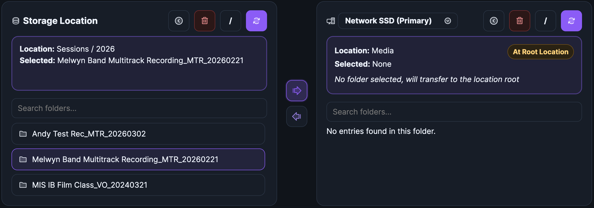
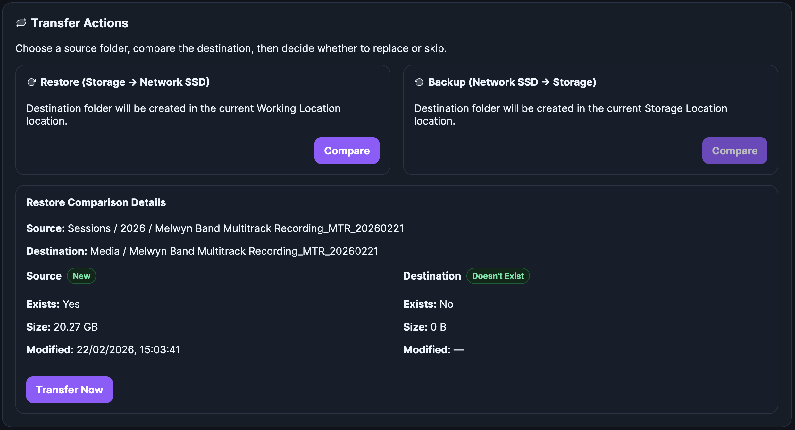
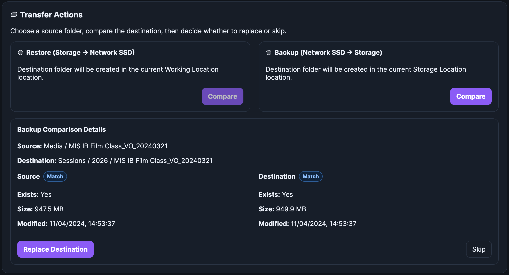
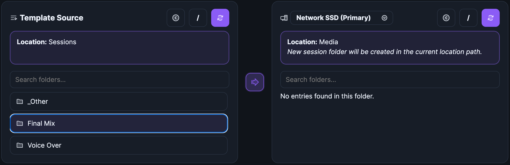
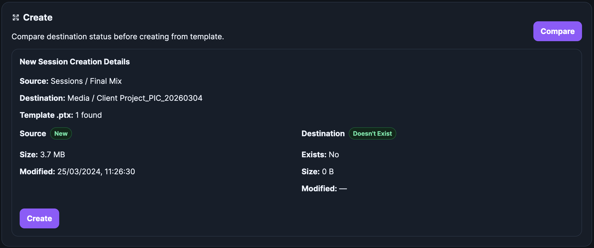
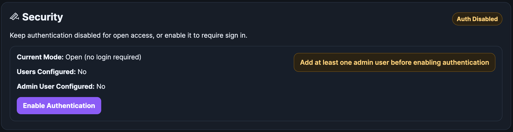
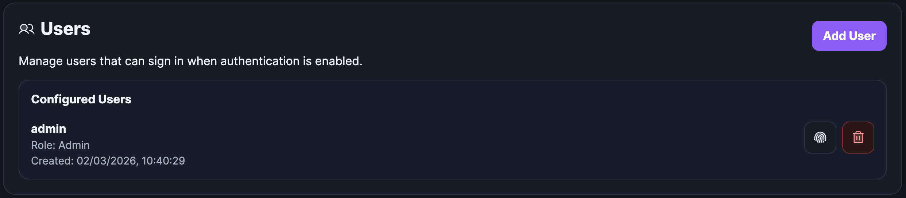
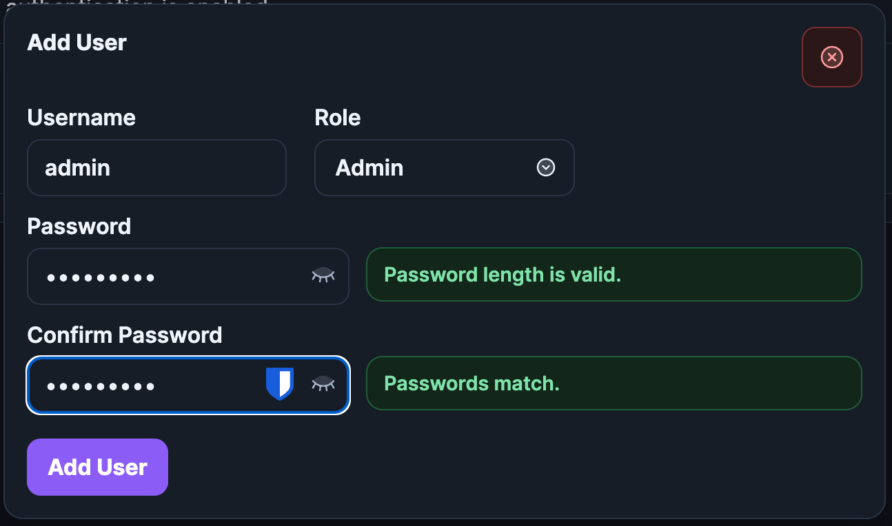

# Usage

The app is split into 2 parts: Restore | Backup Session, and New Session.

**Restore | Backup Session**

This is used to browse your storage and working locations and transfer sessions between the 2, namely restoring from the storage location, or backing up from the working location.
The app is designed to replace any session on either side, so it always does a compare process first, and gives you details like size and modification date so you can choose to replace or not.

 

**New Session**

This is used to copy a template session to a working location and name the session as configured by the name scheme builder.

It also does a comparison first, just in case.

---

# Settings

## Security

By default, the app is configured as an open webpage, but it can be configured to enable authentication.

## Users

If you do enable authentication, it will prompt you to create an admin user if one doesn't exist. All users can be managed in the **Users** section.

